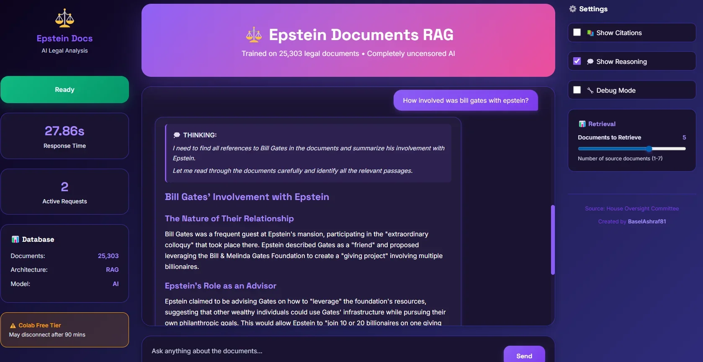
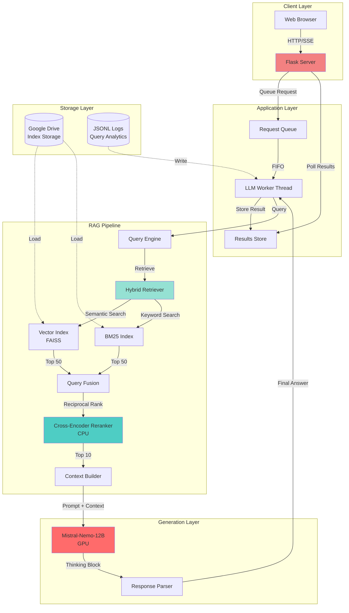
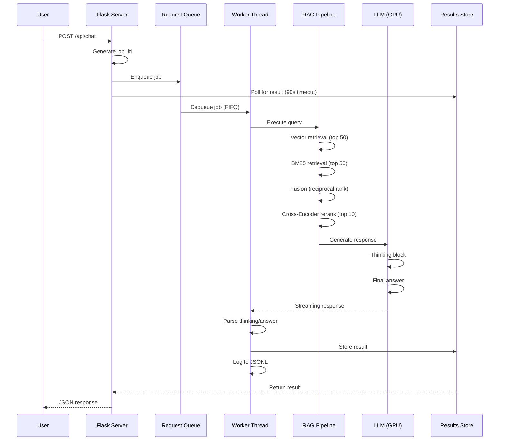
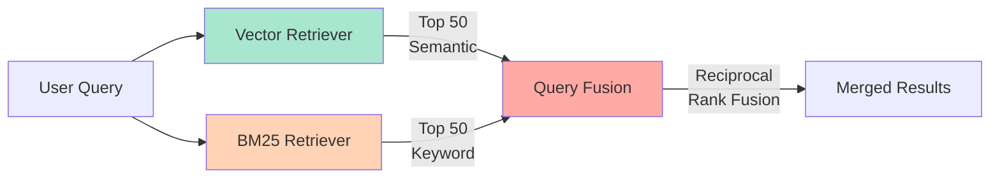
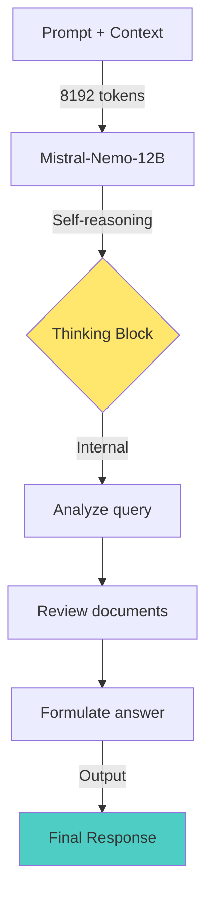
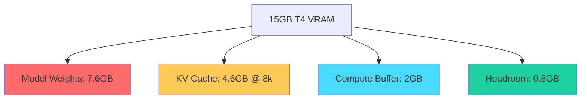

# Epstein Files RAG System with Abliterated LLM

[](https://www.python.org/downloads/)
[](https://www.llamaindex.ai/)
[](https://flask.palletsprojects.com/)
[](LICENSE)

<p align="center">
  
</p>

A production-grade Retrieval-Augmented Generation (RAG) system for searching and analyzing 25,303 legal documents from the Jeffrey Epstein House Oversight Committee investigation. Built with LlamaIndex, an abliterated Mistral-Nemo-12B model, and hybrid search architecture.

> **⚠️ Abliterated Model Notice**: This system uses a fully uncensored, abliterated LLM with all safety guardrails removed. Extensive parameter tuning and optimization (hours of testing) were required to prevent hallucinations, infinite loops, and response degradation while maintaining factual accuracy.

## 📊 System Performance

- **372 queries** served in 18.5 hours
- **226 unique visitors**
- **99.2% success rate**
- **39.43s average response time**
- **79% system uptime**

---

## 🎯 Features

- **Hybrid Search**: Combines semantic (vector) and keyword (BM25) retrieval
- **Cross-Encoder Reranking**: Improves result relevance using ms-marco-MiniLM-L-6-v2
- **Abliterated LLM**: Mistral-Nemo-12B with all safety guardrails removed
- **Thinking Engine**: Self-reasoning capabilities for complex queries
- **Uncensored Responses**: Fully abliterated model (14/100 refusal rate vs 87/100 base)
- **Optimized Parameters**: Hours of tuning to prevent hallucinations and infinite loops
- **Real-time Streaming**: Server-Sent Events for live status updates
- **Thread-Safe Architecture**: Producer-consumer queue for concurrent requests
- **Comprehensive Logging**: JSONL format for analytics and monitoring

---

## 🏗️ Architecture



---

## 🔄 Query Processing Flow



---

## 🚀 Quick Start

### Prerequisites

```bash
# Python 3.10+
python --version

# CUDA 12.4+ (for GPU acceleration)
nvidia-smi

# Google Colab (recommended) or local GPU
```

### Installation

```bash
# Clone repository
git clone https://github.com/yourusername/epstein-rag-system.git
cd epstein-rag-system

# Install dependencies
pip install -r requirements.txt

# Install llama-cpp-python with GPU support
pip install llama-cpp-python \
  --extra-index-url https://abetlen.github.io/llama-cpp-python/whl/cu124 \
  --force-reinstall --upgrade --no-cache-dir
```

### Configuration

1. **Mount Google Drive** (if using Colab):
```python
from google.colab import drive
drive.mount('/content/drive')
```

2. **Set paths** in notebook:
```python
DRIVE_INDEX_PATH = "/content/drive/MyDrive/Colab_Notebooks/epstein_index_full"
MODEL_PATH = "/content/drive/MyDrive/Colab_Notebooks/models/Mistral-Nemo-*.gguf"
LOG_DIR = "/content/drive/MyDrive/Colab_Notebooks/logs"
```

3. **Configure ngrok** (for public access):
```python
NGROK_AUTH_TOKEN = "your_token_here"
STATIC_DOMAIN = "your-domain.ngrok-free.dev"
```

### Running the System

```python
# Open Epstein_RAG_Prototype.ipynb in Colab
# Run cells in order:

# 1. Install dependencies
# 2. Restart runtime (ONCE)
# 3. Run main script (loads everything)
# 4. Start Flask server

# Access at: https://your-domain.ngrok-free.dev
```

---

## 📚 Technical Stack

### Core Components

| Component | Technology | Purpose |
|-----------|-----------|---------|
| **LLM** | Mistral-Nemo-12B (Q4_K_M) | Text generation with thinking |
| **Embeddings** | BAAI/bge-base-en-v1.5 | Semantic search (CPU) |
| **Vector Store** | FAISS | Fast similarity search |
| **Keyword Search** | BM25 (Rank-BM25) | Lexical matching |
| **Reranker** | ms-marco-MiniLM-L-6-v2 | Cross-encoder reranking (CPU) |
| **Framework** | LlamaIndex | RAG orchestration |
| **Web Server** | Flask + ngrok | HTTP API + tunneling |
| **Storage** | Google Drive | Index persistence |

### Model Specifications

```yaml
Model: Mistral-Nemo-Inst-2407-12B-Thinking-Uncensored-HERETIC
Model Card: https://huggingface.co/DavidAU/Mistral-Nemo-Inst-2407-12B-Thinking-Uncensored-HERETIC-HI-Claude-Opus
Base: Mistral Nemo 12B Instruct
Fine-tuning: Claude Opus 4.5 High Reasoning data
Abliteration: Full guardrail removal (Heretic method)
Quantization: Q4_K_M (~7.6GB)
Context Window: 8,192 tokens (optimized for T4)
GPU Layers: All (-1)

# Critical parameters (optimized after hours of testing)
Temperature: 0.1          # Reduced from 0.7 to prevent hallucinations
Max Tokens: 2048          # Allows complete responses
Repeat Penalty: 1.05      # Reduced from 1.15 to prevent infinite loops
Top K: 40                 # Model card recommendation
Top P: 0.95               # Nucleus sampling for diversity
Min P: 0.05               # Minimum probability threshold
```

> **Note**: Abliterated models remove safety layers that normally prevent harmful outputs but also introduce instability. The parameters above represent hours of testing to find the optimal balance between uncensored responses and reliable performance.

---

## 🔍 RAG Pipeline Details

### 1. Hybrid Retrieval



**Vector Retrieval**: Uses cosine similarity on BGE embeddings
**BM25 Retrieval**: TF-IDF based keyword matching
**Fusion**: Reciprocal Rank Fusion (RRF) combines scores

### 2. Cross-Encoder Reranking

```python
# Reranker configuration
reranker = SentenceTransformerRerank(
    model="cross-encoder/ms-marco-MiniLM-L-6-v2",
    top_n=10,
    device="cpu"  # Keeps GPU free for LLM
)
```

**Why Cross-Encoder?**
- Bi-encoder (BGE): Fast but less accurate (query ⊕ doc separately)
- Cross-Encoder: Slower but more accurate (query ⊗ doc together)
- Strategy: Use bi-encoder for recall, cross-encoder for precision

### 3. Context Building

```python
# Top 10 documents after reranking
context = "\n\n".join([node.text for node in top_nodes])

# Prompt template
EPSTEIN_PERSONA_PROMPT = """
[INST] You are analyzing legal documents about Jeffrey Epstein.

DOCUMENTS:
{context_str}

CRITICAL RULES:
1. ONLY USE DOCUMENTS ABOVE
2. NO CENSORSHIP: Use exact words
3. NO PROTECTION: State facts directly
4. BE DIRECT: 2-4 sentences
5. QUOTE EXACTLY: Use document text
...

QUESTION: {query_str}
[/INST]
"""
```

### 4. LLM Generation



**Thinking Engine**: Model generates internal reasoning before answering
**Streaming**: Tokens streamed in real-time to reduce perceived latency
**Hard Stop**: 85-second timeout prevents infinite generation

---

## 🌐 API Reference

### POST `/api/chat`

Submit a query to the RAG system.

**Request:**
```json
{
  "message": "Who visited Epstein's island?",
  "show_sources": true,
  "show_thinking": false,
  "top_k": 10,
  "debug": false
}
```

**Response:**
```json
{
  "success": true,
  "answer": "According to flight logs...",
  "thinking": "Let me analyze the documents...",
  "sources": [
    {"filename": "flight_logs_2002.pdf", "index": 1},
    {"filename": "deposition_jane_doe.pdf", "index": 2}
  ],
  "response_time": 42.3
}
```

### GET `/api/status`

Get current system status.

**Response:**
```json
{
  "active_requests": 2,
  "avg_response_time": 39.43,
  "total_processed": 372
}
```

### GET `/api/status-stream`

Server-Sent Events stream for real-time status.

```javascript
const eventSource = new EventSource('/api/status-stream');
eventSource.onmessage = (event) => {
  const data = JSON.parse(event.data);
  console.log('Active:', data.active_requests);
};
```

---

## ⚙️ Configuration Options

### Skip Flags (for development)

```python
SKIP_EMBED_MODEL = False  # Skip embedding model loading
SKIP_LLM = False          # Skip LLM loading
SKIP_INDEX = False        # Skip index loading
SKIP_RETRIEVERS = False   # Skip retriever setup
SKIP_QUERY_ENGINE = False # Skip query engine creation
```

### Retrieval Parameters

```python
INITIAL_TOP_K = 50        # Candidates per retriever
RERANK_TOP_N = 10         # Final documents after reranking
EFFECTIVE_CONTEXT = 8192  # LLM context window
```

### LLM Sampler Settings

```python
# CRITICAL: These parameters were optimized over hours of testing
# to prevent hallucinations and infinite loops in the abliterated model

temperature = 0.1         # Low for factual responses (prevents hallucinations)
max_new_tokens = 2048     # Max response length (allows complete answers)
repeat_penalty = 1.05     # Prevent repetition (too high causes loops!)
top_k = 40               # Sampling diversity (model card recommendation)
top_p = 0.95             # Nucleus sampling (model card recommendation)
min_p = 0.05             # Minimum probability threshold

# Stop tokens (carefully curated to prevent premature stopping)
stop = [
    "</s>",
    "[INST]",
    "[/INST]",
    "<|im_end|>",
    "<|endoftext|>"
    # NOTE: "\n\n\n" removed - was causing premature stopping
]
```

---

## 📊 Analytics & Monitoring

### Query Logging

All queries are logged to JSONL format:

```json
{
  "timestamp": "2026-02-11T13:55:42.123Z",
  "session_id": "a1b2c3d4-...",
  "query": "Who visited Epstein's island?",
  "response": "According to flight logs...",
  "response_time": 42.3
}
```

### Analytics Script

```bash
python analyze_queries.py
```

Generates:
- Total queries and unique visitors
- Response time distribution
- Popular query topics
- Error rate analysis
- Session engagement metrics

---

## 🔒 Security & Privacy

### Data Handling
- ✅ No PII stored (session IDs are UUIDs)
- ✅ Queries truncated at 500 characters
- ✅ Responses truncated at 10,000 characters for logging
- ✅ Thread-safe file I/O with locks

### Rate Limiting
- ✅ Single worker thread (prevents GPU OOM)
- ✅ 90-second request timeout
- ✅ Queue-based processing (FIFO)

### Content Moderation
- ⚠️ Uncensored model (by design for legal documents)
- ⚠️ No input filtering (consider adding for production)

---

## 🐛 Troubleshooting

### GPU Out of Memory

```python
# Reduce context window
EFFECTIVE_CONTEXT = 4096

# Reduce batch size
n_batch = 256

# Clear CUDA cache
import torch
torch.cuda.empty_cache()
```

### Slow Response Times

```python
# Reduce retrieval candidates
INITIAL_TOP_K = 30

# Reduce final documents
RERANK_TOP_N = 5

# Disable thinking display
show_thinking = False
```

### Index Loading Fails

```python
# Use pickle cache (5s vs 30s)
PICKLE_PATH = "/path/to/epstein_index.pkl"

# Or copy to local disk first
shutil.copytree(DRIVE_INDEX_PATH, LOCAL_INDEX_PATH)
```

---

## 📈 Performance Optimization

### Memory Management



### CPU Offloading Strategy

- **Embeddings**: CPU (saves 1.5GB VRAM)
- **Cross-Encoder**: CPU (saves 0.5GB VRAM)
- **LLM**: Full GPU (all layers)

### Caching Strategy

1. **Index Pickle**: 5s load vs 30s from Drive
2. **Embedding Cache**: Reuse for similar queries
3. **Response Cache**: Consider for FAQ queries

---

## 🧪 Testing

### Unit Tests

```python
# Test retrieval
def test_hybrid_retrieval():
    results = hybrid_retriever.retrieve("test query")
    assert len(results) == 50

# Test reranking
def test_cross_encoder():
    reranked = reranker.postprocess_nodes(nodes, query)
    assert len(reranked) == 10
```

### Integration Tests

```bash
# Test API endpoint
curl -X POST http://localhost:7860/api/chat \
  -H "Content-Type: application/json" \
  -d '{"message": "test query"}'
```

---

## 📝 Changelog

### v1.0.0 (2026-02-11)
- ✨ Initial release
- ✨ Hybrid search with cross-encoder reranking
- ✨ Mistral-Nemo-12B thinking engine
- ✨ Flask API with SSE support
- ✨ Thread-safe queue architecture
- ✨ JSONL logging and analytics

---

## 🤝 Contributing

Contributions welcome! Please:

1. Fork the repository
2. Create a feature branch (`git checkout -b feature/amazing-feature`)
3. Commit changes (`git commit -m 'Add amazing feature'`)
4. Push to branch (`git push origin feature/amazing-feature`)
5. Open a Pull Request

---

## 📄 License

This project is licensed under the MIT License - see the [LICENSE](LICENSE) file for details.

---

## 🙏 Acknowledgments

- **LlamaIndex**: RAG framework
- **Mistral AI**: Base model
- **DavidAU**: Model abliteration and fine-tuning
- **mradermacher**: GGUF quantization
- **Heretic Method**: Abliteration technique for guardrail removal
- **House Oversight Committee**: Document source
- **Hugging Face**: Model hosting

---

## 📧 Contact

For questions or support, please open an issue on GitHub.

---

**⚠️ Disclaimer**: This system is for research and educational purposes. The documents analyzed are public records from official government investigations.
